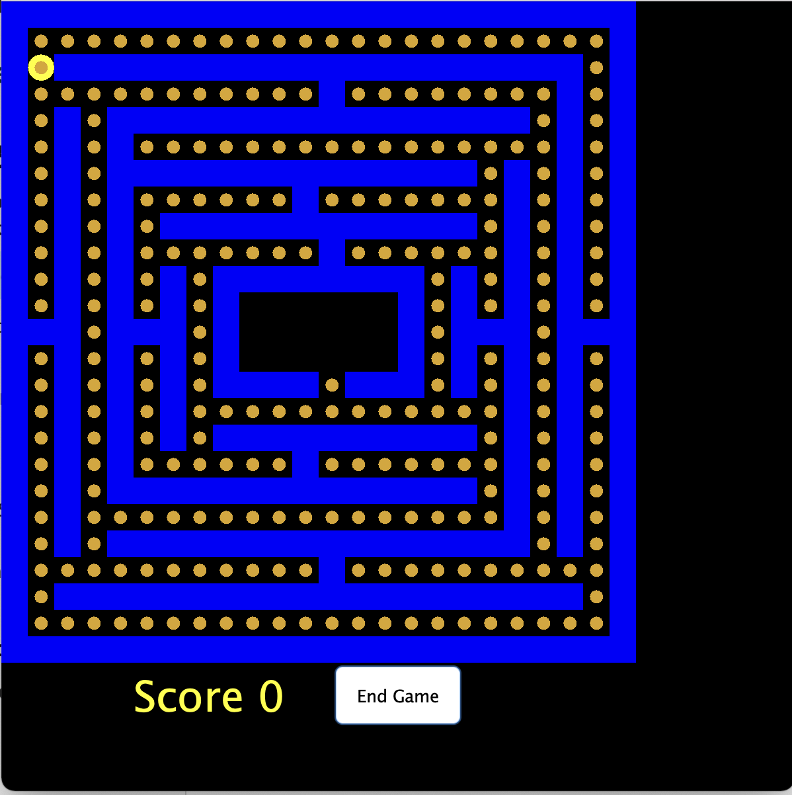

# Project 2: PacMan

## Team 5
- Andrew Liu
- Malchu Pascual
- Sahil Goel
- Saketh Kura

## Running the Code from Command Line

### Navigating to the Right Directory
- Make sure that you are in the P2 directory

### Compiling the source and test code

```bash
gradle build
```

### Running the StartMenu

```bash
gradle run
```

## PacMan in Action

### Below is an image of our PacMan game being played



## PacMan Class Implementation

### get_valid_moves()
- **Description:**  We create four potential locations for the four directions (up, down, left, right) from the current location. We check if there is a Wall object in that location. If not, we add that location to an ArrayList of locations. At the end, we return this list of locations. he test case checks to see if the current location of Pacman has four possible locations. If it doesn't it throws an error.

### move()
- **Description:** We first check to see if there are any valid moves. If there are no valid moves, we return false. Otherwise, we take the first possible valid move and execute that move by invoking the move() method from Map and updating the pacman's location if the move was successful. If the move was successful, we return true. Otherwise, we return false. The test case invokes a game, instantiates a pacman, and then throws an exception if the expected functionality does not occur.

### is_ghost_in_range()
- **Description:** We first identified possible locations of ghost in range, that is north, south, west, and east. We then obtained the types of objects at each given location using the getLoc() method from Map.java. Finally, we check to see if north, south, west, or east contains the type Map.Type.GHOST,  if so then we return true. Otherwise there are no ghost in range so we return false. The test invokes a game, instantiates a pacman, and throws an exception if ghost is in range while no ghost exist and throws an exception if ghost is not in range while a ghost is right next to the pacman.

### consume()
- **Description:** We first check if the current location of Pacman also has a cookie there. If there is, Pacman will consume the cookie and return the cookie component. Otherwise, we return null if a cookie is not at the same location of the current location of Pacman. The test checks if Pacman will eat the cookie if both Pacman and the cookie are at the same location. If Pacman does not eat the cookie, an exception is thrown.

## Ghost Class Implementation

### get_valid_moves()
- **Description:** We create four potential locations for the four directions (up, down, left, right) from the current location. We check if there is a Wall object in that location. If not, we add that location to an ArrayList of locations. At the end, we return this list of locations. The test case checks to see if the current location of the Ghost has four possible locations. If it doesn't it throws an error.

### move()
- **Description:** We first check to see if there are any valid moves. If there are no valid moves, we return false. Otherwise, we take the first possible valid move and execute that move by invoking the move() method from Map and updating the ghost's location if the move was successful. If the move was successful, we return true. Otherwise, we return false. The test case invokes a game, instantiates a ghost, and then throws an exception if the expected functionality does not occur.

### is_pacman_in_range()
- **Description:** We first identified possible locations of pacman in range, that is north, south, west, and east. We then obtained the types of object at each given location using the getLoc() method from Map.java. Finally, we check to see if north, south, west, or east contains the type Map.Type.PACMAN,  if so then we return true. Otherwise there are no pacman in range so we return false. The test invokes a game, instantiates a ghost, and throws an exception if pacman is in range while no pacman exist and throws an exception if pacman is not in range while a pacman is right next to the ghost.

### attack()
- **Description:** We first check if Pacman is in range of the Ghost by calling the is_pacman_in_range function. If it is, we attack Pacman and return true. Otherwise, we return false if we cannot attack Pacman. The test checks if a Ghost attacks Pacman if both of them are at the same location. If the Ghost does not attack Pacman, an exception is thrown.

## Map Class Implementation

### move(String name, Location loc, Type type)
- **Description:** We check to see if we can move the object to the new location. If we can, we return true, otherwise false. We first need to check if the name exists in the location, component, and fields datastructures, otherwise we return false. We then get the original location and object components, change the object's location to the new one and put this new location with the name in the location data structure. We update the fields data structure as well with the new location. Finally, we can return true. The test case checks to see if the move of the object was possible. 

### getLoc(Location loc)
- **Description:** We check the field variable at the given location to see if there have been any types added to that location. If there is no key associated with that location, then we know the location is empty so we return an empty set. Otherwise, we return the value of the location key in the field variable to get the set of types that exist at the specified location. The test case invokes a game, instantiates a pacman, and then throws an exception if the set returned from getLoc does not contain the PACMAN type.

### attack(String name)
- **Description:** We first obtain information on whether a ghost exist or not by passing the ghost name as argument in the get() method from hashmap. If the result from the get method is null, that means the corresponding ghost does not exist so we return false. Otherwise the ghost exist, and we begin to identify possible valid locations of pacman in range. We then check if each possible locations actually contains pacman instances, if so then we update gameOver to true and return true, otherwise we do not attack and just return false. The test invokes a game, instantiates a ghost, and throws an exception if ghost attack returns true when no pacman exist. It also throws an exception if attack returns false, when a pacman is in attack range of the ghost

### eatCookie(String Name)
- **Description:** We first check if there is a cookie at the current location of the Pacman. If there is a cookie at Pacman's location, then Pacman can eat the cookie, so the number of cookies will be decremented by 1. Also, since Pacman eats the cookie, we remove the cookie at the location of Pacman, and return that cookie component. If there isn't a cookie at Pacman's location, we return null. The test checks if Pacman eats a cookies if it is at his location by adding a Pacman and cookie at the same location. If it doesn't eat it, an exception is thrown.
